Seoul Welfare system
================

서울시 복지제도 홍보 확대의 필요성
----------------------------------

분석주제
--------

서울복지실태조사 데이터를 활용하여 주요 복지수요가구를 일반가구와 비교하여 **복지 혜택의 필요성**을 확인하고, **복지제도의 인식여부**를 분석하여 **복지제도 홍보 확대를 제언한다.**

초록
----

분석방법 : 일반가구와 서울복지실태조사 코드표를 보면 알 수 있는 주요 복지 수요 가구인 **다문화, 노인, 영유아, 장애인 가구**를 분류하여 비교 분석한다. 주요 복지 수요 가구의 **복지제도 인식 여부 및 관련 정보 습득 경로**를 분석하여 복지제도 **홍보 확대의 필요성과 홍보 확대 효과를 극대화 할 수 있는 방법**을 구체적으로 제언한다.

분석에 앞서 몇 가지 전제조건과 가설이 있다. 첫 번째로 **'복지 혜택을 필요로 하는 가구는 소득수준이 일반가구에 비해 낮을 것이다.'**이다. 이 전제를 기준으로 사전에 지정한 *다문화, 노인, 영유아, 장애인 가구*가 복지수요 가구로의 조건을 충족하는 지 확인한다. 두 번째로 **'복지수요 가구는 일반가구에 비해서 저 적은 생활비로 살아갈 것이다.'**라는 전제를 둔다. 가구의 생활수준이 낮을 경우 정부적 차원에서 도움을 주는 것이 복지제도라는 점에서 위에서 미리 지정한 *다문화, 노인, 영유아, 장애인 가구*의 복지수요 가구 지정 설득력을 높인다. 세 번째로 **'복지제도의 혜택을 받을 수 없는 이유가, 까다로운 조건에 비해서 정보를 충분히 얻을 수 없기 때문일 것이다.'**라는 가설을 세웠다. 이를 통해서 복지수요 가구가 복지 혜택에 대한 인식이 낮고 그 이유가 정보를 얻을 루트가 다양하지 않기 때문이라는 점을 도출하여 최종적 결론인 **'서울시 복지제도 홍보 확대'**를 이끌어낸다.

분석 및 해
----------

##### 데이터 분석 준비

``` r
# 우선 데이터 분석에 필요한 패키지를 로드한 후 필요 데이터를 테이터 프레임의 형태로 로드한다.

library(readxl)
library(dplyr)
library(ggplot2)

data <- read_excel("2015_서울복지실태조사_데이터.xlsx")

# 데이터 분석이 용이할 수 있도록 변수명을 다시 설정해준다,

data <- rename(data, fam_Multi = fam_m)
data <- rename(data, fam_Old = fam_o)
data <- rename(data, fam_Youth = fam_y)
data <- rename(data, fam_Handi = fam_h)

#Multi = 다문화, Old = 노인, Youth = 영유아, Handi = 장애인
```

##### 주요 복지수요 가구 분류

코드표를 참고하여 **다문화, 노인, 영유아, 장애인 가구**에 응답 여부로 일반 가구와 복지수요 가구를 분류한다. *(단, 중복체크한 가구는 가구형태의 성격이 섞인 응답을 할 수도 있기 때문에 제외한다.)*

``` r
# 이 가구 형태를 전부 하나로 묶어서 분석할 수도 있지만 다른 집단의 성격에 한 집단의 특이성이 묻힐수도 있다는 문제점 때문에 모두 구별후 분석 진행.

fam_Multi <- data %>% 
  filter(fam_Multi == 1 & fam_Old == 2 & fam_Youth == 2 & fam_Handi == 2)

fam_Old <- data %>% 
  filter(fam_Old == 1 & fam_Multi == 2 & fam_Youth == 2 & fam_Handi == 2)

fam_Youth <- data %>% 
  filter(fam_Youth == 1 & fam_Multi == 2 & fam_Old ==2 & fam_Handi == 2)

fam_Handi <- data %>% 
  filter(fam_Handi == 1 & fam_Multi == 2 & fam_Old == 2 & fam_Youth == 2)

# 일반가구

fam_common <- data %>% 
  filter(fam_Handi == 2 & fam_Youth == 2 & fam_Multi == 2 & fam_Old == 2)

# 다문화 가구의 경우 총 표본 수가 5가구이므로 간단하게 경향성만 드러내는 것으로 해석
```

##### 각 가구형태 별 소득수준 분석

각 가구형태 별로 수득수준을 비교하여 복지수요 가구(**다문화, 노인, 영유아, 장애인**)의 복지제도 필요성을 분석해보고, 기본 전제(**'복지 혜택을 필요로 하는 가구는 소득수준이 일반가구에 비해 낮을 것이다.'**)를 확인한다.

``` r
# 각 가구별 소비지출 형태
# 각 가구의 소득수준을 비교하는데 있어서, 복지제도와의 연관성을 위해서 소득수준보다는 월 생활비를 비교했다.
# 여기서의 전제는 '복지수요 가구는 일반 가구보다 더 적은 생활비로 살아갈 것이다.'이다.
# 이 문항에 대한 답은 주관적인 대답이므로 결측치 및 이상치를 미리 제거한 후에 평균값으로 분석한다.
# 이상치를 제거했기 때문에 평균값을 사용했을 때 나타나는 극단값에 평균값이 몰리는 현상을 최소화한다.

## 일반 가구
# 결측치 확인 및 제거
fam_common_clean <- fam_common %>% filter(!is.na(B2))
# 이상치 확인 및 제거
boxplot(fam_common_clean$B2)
boxplot(fam_common_clean$B2)$stats
```

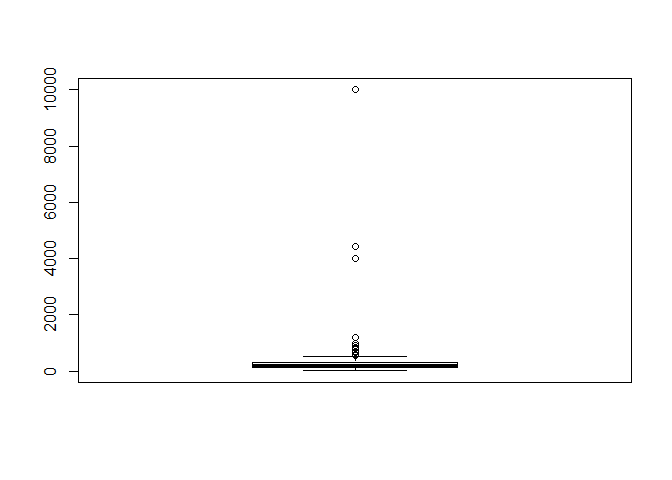

    ##      [,1]
    ## [1,]   15
    ## [2,]  140
    ## [3,]  200
    ## [4,]  300
    ## [5,]  540

``` r
fam_common_clean_month_spend <- fam_common_clean %>% 
  filter(B2 >= 15 & B2 <= 540)

summary(fam_common_clean_month_spend$B2)
```

    ##    Min. 1st Qu.  Median    Mean 3rd Qu.    Max. 
    ##    15.0   130.0   200.0   223.2   300.0   540.0

``` r
## 다문화 가구
# 결측치 확인 및 제거
fam_Multi_clean <- fam_Multi %>% filter(!is.na(B2))
# 이상치 확인 및 제거
boxplot(fam_Multi_clean$B2)
boxplot(fam_Multi_clean$B2)$stats
```

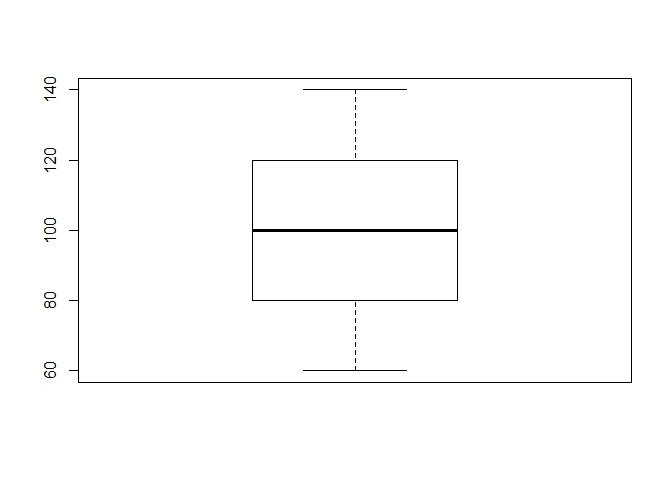

    ##      [,1]
    ## [1,]   60
    ## [2,]   80
    ## [3,]  100
    ## [4,]  120
    ## [5,]  140

``` r
fam_Multi_clean_month_spend <- fam_Multi_clean %>% 
  filter(B2 >= 60 & B2 <= 140)

summary(fam_Multi_clean_month_spend$B2)
```

    ##    Min. 1st Qu.  Median    Mean 3rd Qu.    Max. 
    ##      60      80     100     100     120     140

``` r
## 노인 가구
# 결측치 확인 및 제거
fam_Old_clean <- fam_Old %>% filter(!is.na(B2))
# 이상치 확인 및 제거
boxplot(fam_Old_clean$B2)
boxplot(fam_Old_clean$B2)$stats
```

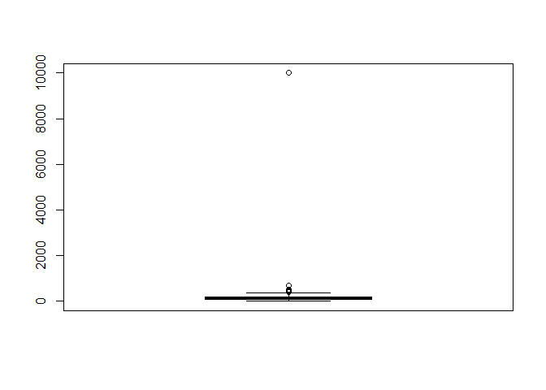

    ##      [,1]
    ## [1,]    5
    ## [2,]   80
    ## [3,]  130
    ## [4,]  200
    ## [5,]  360

``` r
fam_Old_clean_month_spend <- fam_Old_clean %>% 
  filter(B2 >= 5 & B2 <= 360)

summary(fam_Old_clean_month_spend$B2)
```

    ##    Min. 1st Qu.  Median    Mean 3rd Qu.    Max. 
    ##     5.0    80.0   130.0   143.9   200.0   360.0

``` r
## 영유아 가구
# 결측치 확인 및 제거
fam_Youth_clean <- fam_Youth %>% filter(!is.na(B2))
# 이상치 확인 및 제거
boxplot(fam_Old_clean$B2)
boxplot(fam_Old_clean$B2)$stats
```

    ##      [,1]
    ## [1,]    5
    ## [2,]   80
    ## [3,]  130
    ## [4,]  200
    ## [5,]  360

``` r
fam_Youth_clean_month_spend <- fam_Youth_clean %>% 
  filter(B2 >= 5 & B2 <= 360)

summary(fam_Youth_clean_month_spend$B2)
```

    ##    Min. 1st Qu.  Median    Mean 3rd Qu.    Max. 
    ##      50     180     200     226     300     350

``` r
# 영유아 가구의 경우 고소득자 가정도 집계될 수 있기 때문에 일반가구(223.2)에 비해 더 적은 생활비로 살아가는 가구로 한정
fam_Youth_clean_month_spend_real <- fam_Youth_clean %>% 
  filter(B2 >= 5 & B2 <= 223.2)

summary(fam_Youth_clean_month_spend_real$B2)
```

    ##    Min. 1st Qu.  Median    Mean 3rd Qu.    Max. 
    ##    50.0   150.0   180.0   165.2   200.0   220.0

``` r
## 장애인 가구
fam_Handi_clean <- fam_Handi %>% filter(!is.na(B2))
# 이상치 확인 및 제거
boxplot(fam_Handi_clean$B2)
boxplot(fam_Handi_clean$B2)$stats
```

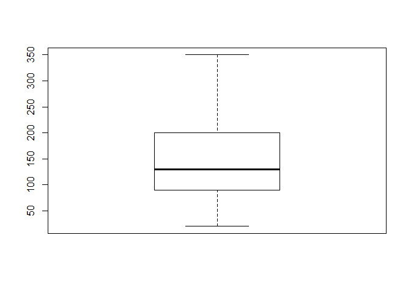

    ##      [,1]
    ## [1,]   20
    ## [2,]   90
    ## [3,]  130
    ## [4,]  200
    ## [5,]  350

``` r
fam_Handi_clean_month_spend <- fam_Handi_clean %>% 
  filter(B2 >= 20 & B2 <= 350)

summary(fam_Handi_clean_month_spend$B2)
```

    ##    Min. 1st Qu.  Median    Mean 3rd Qu.    Max. 
    ##    20.0    90.0   130.0   147.7   200.0   350.0

``` r
## 각 가구별 통계자료로 새로운 데이터 프레임 생성

fam_month_spend <- data.frame(fam_com = c(15, 130, 200, 223.2, 300, 540),
                              fam_Mul = c(60, 80, 100, 100, 120, 140),
                              fam_Old = c(5, 80, 130, 143.9, 200, 360),
                              fam_You = c(50, 150, 180, 165.2, 200, 220),
                              fam_Han = c(20, 90, 130, 147.7, 200, 350))
fam_month_spend
```

    ##   fam_com fam_Mul fam_Old fam_You fam_Han
    ## 1    15.0      60     5.0    50.0    20.0
    ## 2   130.0      80    80.0   150.0    90.0
    ## 3   200.0     100   130.0   180.0   130.0
    ## 4   223.2     100   143.9   165.2   147.7
    ## 5   300.0     120   200.0   200.0   200.0
    ## 6   540.0     140   360.0   220.0   350.0

``` r
## 평균값 데이터 프레임

fam_mean_spend <- data.frame(name = c("com", "Mul", "Old", "You", "Han"),
                             mean = c(223.2, 100, 143.9, 165.2, 147.7))

# com = 일반, Mul = 다문화, Old = 노인, Youth = 영유아, Handi = 장애인
fam_mean_spend
```

    ##   name  mean
    ## 1  com 223.2
    ## 2  Mul 100.0
    ## 3  Old 143.9
    ## 4  You 165.2
    ## 5  Han 147.7

``` r
ggplot(data = fam_mean_spend, aes(x = reorder(name, mean), y = mean, fill = mean)) + geom_col() + coord_flip()
```

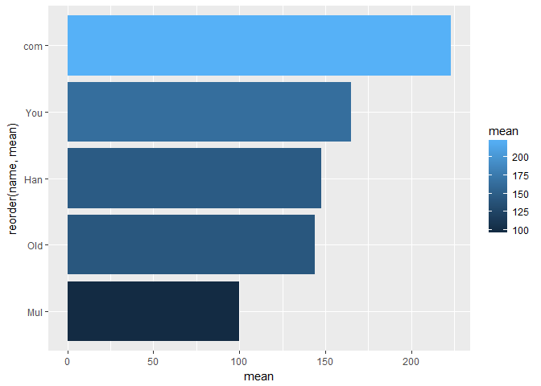

위의 분석결과를 통해서 **다문화, 노인, 영유아, 장애인 가구**가 일반가구에 비해서 확실하게 월 생활비 수준이 **3/4에서 많게는 절반정도**로 낮은 것을 알 수 있다. 따라서 복지수요 가구의 조건을 충분히 충족할 수 있다고 할 수 있다.

##### 가구형태 별 복지제도 인식 실태 분석

위의 분석을 토대로 복지수요 가구를 분류하였으며 이를 토대로 각 가구형태의 복지제도 인식 실태를 분석한다.

복지제도 인식 여부를 파악할 수 있는 문항을 '*복지제도 인식 여부*', '*복지제도 정보 습득 경로 인식 여부*', '*서울시 복지제도 기준 인식 여부*'로 나누어서 분석하였다.

##### 복지제도 인식 여부

``` r
# 모든 응답은 객관식으로 1번은 '모른다', 2번은 '대체로 알고 있다', 3번은 '잘 알고 있다'이다.
# 위에서도 언급했듯이 각 가구형태별로 구분하여 분석하는 것으로 집단화 시켜서 분석할 경우 소수집단의 특성이 묻히는 문제점을 보완했다.(복지제도가 가구형태에 따라 다르기 때문)

## 다문화 가구
fam_Multi_known <- fam_Multi %>% select(E29) %>% 
  group_by(E29) %>% 
  summarise(count = n()) %>% 
  mutate(ratio = (count/5)*100)
ggplot(data = fam_Multi_known, aes(x = reorder(E29, ratio), y = count, fill = ratio)) + geom_col() + coord_flip()
```

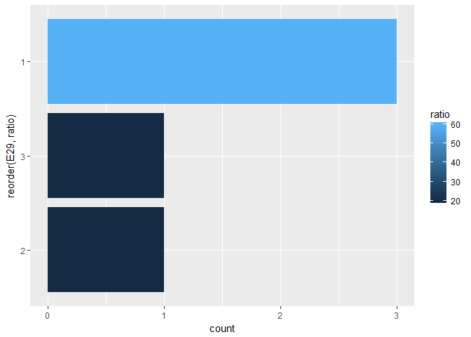

``` r
## 노인 가구
fam_Old_known <- fam_Old %>% select(E29) %>% 
  group_by(E29) %>% 
  summarise(count = n()) %>% 
  mutate(ratio = (count/529)*100)
ggplot(data = fam_Old_known, aes(x = reorder(E29, ratio), y = count, fill = ratio)) + geom_col() + coord_flip()
```

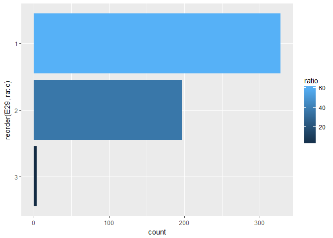

``` r
## 영유아 가구
fam_Youth_known <- fam_Youth %>% select(E29) %>% 
  group_by(E29) %>% 
  summarise(count = n()) %>% 
  mutate(ratio = (count/199)*100)
ggplot(data = fam_Old_known, aes(x = reorder(E29, ratio), y = count, fill = ratio)) + geom_col() + coord_flip()
```


``` r
## 장애인 가구
fam_Handi_known <- fam_Handi %>% select(E29) %>% 
  group_by(E29) %>% 
  summarise(count = n()) %>% 
  mutate(ratio = (count/33)*100)
ggplot(data = fam_Handi_known, aes(x = reorder(E29, ratio), y = count, fill = ratio)) + geom_col() + coord_flip()
```

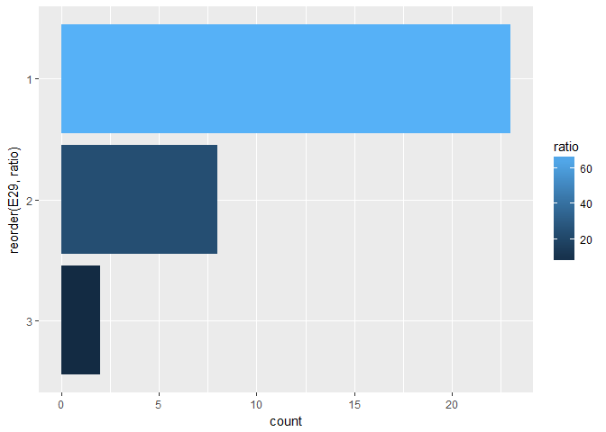

복지를 필요로 하는 모든 가구형태가 복지제도에 대한 인식이 매우 낮으며, 알고 있더라도 잘 아는 수준은 아닌 것을 알 수 있다. 특히 **영유아 가구**의 경우 주로 *복지제도를 신청하는 주체인 부모의 나이대*가 다른 가구형태에 비해 젊다는 점을 예상해보았을 때 **'대체로 잘 알고 있다'가 나온 것이 설명된다.**

##### 복지제도 정보 습득 경로 인식 여부

``` r
# 모든 응답은 객관식으로 1번은 '모른다', 2번은 '대체로 알고 있다', 3번은 '잘 알고 있다'이다.

## 다문화 가구
fam_Multi_known2 <- fam_Multi %>% select(E30) %>% 
  group_by(E30) %>% 
  summarise(count = n()) %>% 
  mutate(ratio = (count/5)*100)
ggplot(data = fam_Multi_known2, aes(x = reorder(E30, ratio), y = count, fill = ratio)) + geom_col() + coord_flip()
```


``` r
## 노인 가구
fam_Old_known2 <- fam_Old %>% select(E30) %>% 
  group_by(E30) %>% 
  summarise(count = n()) %>% 
  mutate(ratio = (count/529)*100)
ggplot(data = fam_Old_known2, aes(x = reorder(E30, ratio), y = count, fill = ratio)) + geom_col() + coord_flip()
```

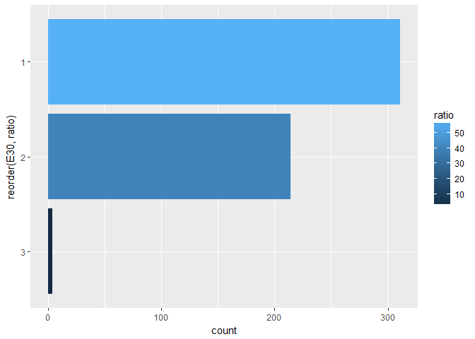

``` r
## 영유아 가구
fam_Youth_known2 <- fam_Youth %>% select(E30) %>% 
  group_by(E30) %>% 
  summarise(count = n()) %>% 
  mutate(ratio = (count/199)*100)
ggplot(data = fam_Youth_known2, aes(x = reorder(E30, ratio), y = count, fill = ratio)) + geom_col() + coord_flip()
```

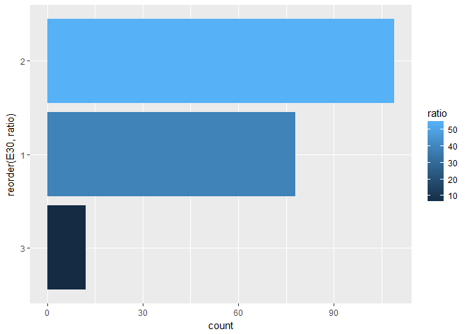

``` r
## 장애인 가구
fam_Handi_known2 <- fam_Handi %>% select(E30) %>% 
  group_by(E30) %>% 
  summarise(count = n()) %>% 
  mutate(ratio = (count/33)*100)
ggplot(data = fam_Handi_known2, aes(x = reorder(E30, ratio), y = count, fill = ratio)) + geom_col() + coord_flip()
```

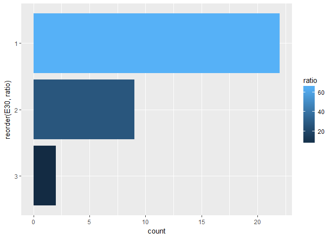

위의 분석결과 역시 모든 가구 형태가 복지제도에 대한 정보를 얻는 경로에 대해서도 **아예 모르는 경우가 대다수**였으며, 알아도 완전히 아는 정도가 아닌 **어느정도 인식하는 정도였다.**

##### 서울시 복지제도 기준 인식 여부

``` r
# 모든 응답은 객관식으로 1번은 '모른다', 2번은 '들어보았지만, 내용은 모름', 3번은 '내용을 어느정도 알고 있음', 4번은 '비교적 자세히 알고 있음'이다.
# 이 문항은 위의 문항과 달리 제도에 따라 답이 달라질 확률이 거의 없었기 때문에 소수집단의 특성과 다수 집단의 특성이 비슷하다고 전제하고 전체 복지수요 가구로 지정하여 진행

# 복지를 필요로 하는 가구들의 데이터프레임

fam_all <- bind_rows(fam_Multi, fam_Old, fam_Youth, fam_Handi)

## 복지 필요 가구 전체
fam_all_Known <- fam_all %>% select(F13) %>% 
  group_by(F13) %>% 
  summarise(count = n()) %>% 
  mutate(ratio = (count/766)*100)
ggplot(data = fam_all_Known, aes(x = reorder(F13, ratio), y = count, fill = ratio)) + geom_col() + coord_flip()
```

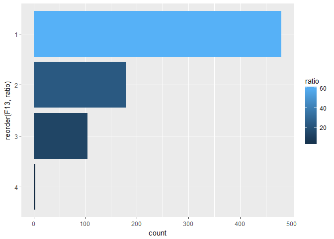

대부분의 가구가 복지제도 기준에 대해서 **'모른다'**고 답했으며, 뒤이어진 응답도 **'알지만 내용은 모른다'**, **'자세히는 모른다'**는 답변이었다.

##### 복지제도 정보 습득

``` r
# 이 문항은 위의 문항들과 달리 각 가구형태 별로 드러나는 특성이 적고 소수집단의 특성이 묻힐 수 있는 상황이 아니라는 판단에 의해서 전체 복지수요 집단으로 합친 후 진행

# 복지수요 가구의 복지제도 정보 습득 경로

fam_all_Known2 <- fam_all %>% select(E31) %>% 
  group_by(E31) %>% 
  summarise(count = n()) %>% 
  mutate(ratio = (count/766)*100)
ggplot(data = fam_all_Known2, aes(x = reorder(E31, ratio), y = count, fill = ratio)) + geom_col() + coord_flip()
```

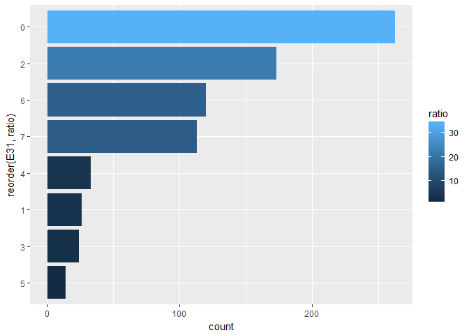

``` r
# 통계 데이터 중 유의미했던 변수명은 0번 = '정보를 얻어본 경험 없음', 2번 = '동주민센터 방문', 6번 = '인터넷 검색'이다.
```

대부분의 가구들이 **'정보를 얻어본 경험이 없다'**고 답했으며 그런적이 있었던 가구는 **동주민센터, 인터넷 검색** 순으로 정보를 습득했다.

결론
----

#### 복지제도 관련 정보 플랫폼의 확대

위의 결과를 보면 대부분의 **복지수요 가구들이 복지제도에 대한 인식이 낮다.** 때문에 *복지제도의 기준에 대한 인식도 낮아 복지 지원을 받기에 힘든 상황이다.* 이는 복지제도 정보 습득 분석결과를 보았을 때 정무가 제공하는 **플랫폼의 부족**으로 인해 생겨난 현상으로 추론할 수 있다. 따라서 정부는 복지제도 **정보를 얻을 수 있는 플랫폼을 확대**해야 할 뿐 아니라 기존의 유용한 플랫폼인 **동주민센터와 인터넷을 더욱 강화**해야 한다.

#### 기존 플랫폼의 강화

##### 기존 플랫폼의 문제점 분석

현재 가장 활발하게 복지제도 관련 정보를 얻을 수 있는 **'동주민센터'**에서의 문제점을 분석한다.

``` r
# 이 문항은 동주민센터에 방문했던 적이 있는 가구만 응답을 한 문항으로 각 가구별로 분석시 표본집단이 줄어드는 문제 발생, 따라서 복지수요 가구라는 통합된 집단으로 분석했다.
# 위에서 언급했던 소수 집단의 특성이 없을 수도 있다는 문제점은 이 문항의 특성상 모두 같은 상황에 있는 혜택 받을 수 있는 제도만 다르다는 전제하에서 소수 집단의 특성이 없어질 우려는 적었다.

# 복지 정보를 동사무소를 방문해서 얻은 가구

fam_all_yes <- fam_all %>% 
  filter(E32 == 1)

# 동주민센터에서 정보를 얻을 경우 생기는 문제점

fam_all_yes_prob <- fam_all_yes %>% select(E32_2) %>% 
  group_by(E32_2) %>% 
  summarise(count = n()) %>% 
  mutate(ratio = (count/766)*100)
ggplot(data = fam_all_yes_prob, aes(x = reorder(E32_2, ratio), y = count, fill = ratio)) + geom_col() + coord_flip()
```

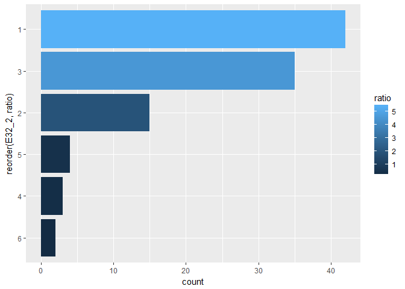

``` r
# 분석결과 가장 유의미 했던 상위 3개의 변수는 1번 '전혀 문제없다', 2번 '내게 필요한 정보가 제대로 없다', 3번 '복지정보는 얻었으나 내게 혜택이 되는 것이 없다'이다.
```

##### 동주민센터 플랫폼의 문제점

위의 겱과로 도출해낸 가장 큰 문제점은 **'내게 필요한 정보가 제대로 없다'**이다. 따라서 가장 많은 복지수요 가구가 정보를 얻는 곳인 **동주민센터에서 복지제도에 대해 더 확실한 정보를 파악**해서 원하는 정보를 정확하게 전달할 수 있도록 해야 할 것 이다.
